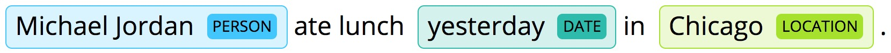

#### A simple zero-dependency React component for displaying user-defined entities within a block of text.

## Demo
Visit the [demo page](https://johncmunson.github.io/react-taggy/) and click on 'knobs' at the bottom to get a feel for how adjusting certain props effects the rendered component.

## Install

`npm i --save react-taggy` or `yarn add react-taggy`

## Basic Usage

#### ES6
`import Taggy from 'react-taggy'`

#### Node Modules
`const Taggy = require('react-taggy').default`

#### Required Props
- `text`: (string || array) The text that will be displayed. May be a string, or an array of tokens.
- `spans`: (array) The locations within the text that will get tagged. If `text` is a string, then `start` and `end` must be provided and refer to character indices. If `text` is an array of tokens, then `index` must be provided and refers to token index.
- `ents`: (array) The allowable entity types and the color of each unique tag type.

#### Example usage where `text` is a string
```javascript
<Taggy text={text} spans={spans} ents={ents} />

const text = 'Michael Jordan ate lunch yesterday in Chicago.'

const spans = [
    {start: 0, end: 14, type: 'PERSON'},
    {start: 25, end: 34, type: 'DATE'},
    {start: 38, end: 45, type: 'LOCATION'}
]

const ents = [
    {type: 'person', color: {r: 166, g: 226, b: 45}},
    {type: 'location', color: {r: 67, g: 198, b: 252}},
    {type: 'date', color: {r: 47, g: 187, b: 171}}
]
```

#### Example usage where `text` is an array
```javascript
<Taggy text={text} spans={spans} ents={ents} />

const text = ['Michael', 'Jordan', 'ate', 'lunch', 'yesterday', 'in', 'Chicago', '.']

const spans = [
  {type: 'person', index: 0},
  {type: 'person', index: 1},
  {type: 'date', index: 4},
  {type: 'location', index: 6}
]

const ents = [
    {type: 'person', color: {r: 166, g: 226, b: 45}},
    {type: 'location', color: {r: 67, g: 198, b: 252}},
    {type: 'date', color: {r: 47, g: 187, b: 171}}
]
```

## Contributions

All contributors will receive proper attribution, as outlined in the awesome [All-Contributors](https://github.com/kentcdodds/all-contributors) specification developed by open-source superstar [Kent C. Dodds](https://twitter.com/kentcdodds?lang=en).

## Development Setup

This component was bootstrapped with [React CDK](https://github.com/kadirahq/react-cdk). Please refer to [React CDK documentation](https://github.com/kadirahq/react-cdk)) to get started with the development.

## Inspiration

This project is originally a fork of [displacy-ent](https://github.com/explosion/displacy-ent) by the guys over at [ExplosionAI](https://explosion.ai/). Now with 100% more React awesomeness!

## License

*react-taggy* is available under BSD. See LICENSE for more details.

## To-Do
- Change the array API to to accept an array of objects that contain `start` and `end` keys, rather than a single `index` key. This will match the string API and will enable multi-word entities without relying on the built-in auto-aggregation.
- The component should not fail if the `ents` and `spans` props are not provided. The `text` should just render like a normal `<p>` tag. Heck, even the `text` prop should be optional, and if it's not provided the component will just render like an empty `<p>` tag would.
- Unit tests, snapshot tests, etc.
- Add ability to disable auto-aggregation
- Create a sister project where the component is just a single tag.
